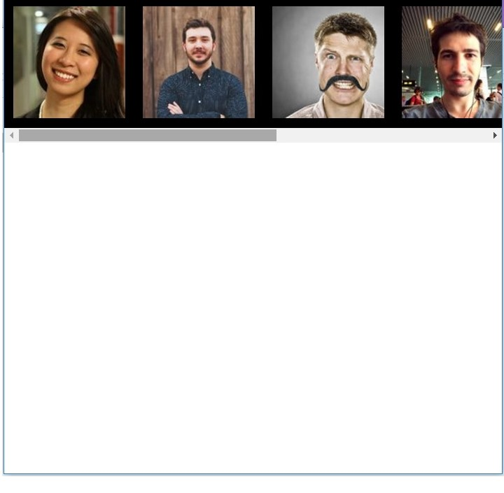

# jQuery - zadania domowe
> Kod wpisz w odpowiednim pliku, zgodnie z poleceniem zadania.
BARDZO WAŻNE - Wasze zadania są sprawdzane przy pomocy automatycznego systemu. Żeby odpowiedzi zostały uznane za poprawne, strony MUSZĄ wyświetlać te same komunikaty co w treści zadania, a funkcje i metody MUSZĄ posiadać nazwy dokładnie takie same jak podane w zadaniu.

> Zadania z dopiskiem "dodatkowe" są dla chętnych. Znajdziesz je na końcu.

### Dzień 1 - Sass
> Zadania z tego dnia wykonuj w pliku main.scss oraz index.html. Wygeneruj odpowiedni plik .css do folderu css

#### Zadanie 1

Napisz mixin o nazwie `setTooltip`, za pomocą którego będzie można ustawić dowolny tekst na tooltipie. Jako argument przekaż tekst do wyświetlenia oraz kolor tooltipa. Niech tooltipy pojawiają się po najechaniu na element `ul` o klasie `lista` znajdujący się w pliku `index.html`
Podpowiedź: Stwórz odpowiedni pseudoelement np. :before lub :after.

#### Zadanie 2

Na podstawie poniższej mapy (za pomoca odpowiedniej funkcji sass), zrób listę zawierającą same wartości.
Następnie za pomocą odpowiedniej pętli ustaw wielkości dla nagłówków z pliku `index.html`, od największego do najmniejszego, wykorzystując wartości listy.

```
$font-sizes: (
 fs1: 100px,
 fs2: 50px,
 fs3: 6px
 );
```
Skorzystaj: http://sass-lang.com/documentation/Sass/Script/Functions.html

### Dzień 2 - RWD część 1
> Zadania z tego dnia wykonuj w pliku main.scss oraz index.html. Wygeneruj odpowiedni plik .css do folderu css

#### Zadanie 1 - Jednostki RWD

W pliku `index.html` znajdziesz sekcję o nazwie `test_units`. Przyjrzyj się jej dokładnie. Wewnąrz jest kilka elementów.
Ustaw sekcji `test_units` wielkość tekstu na `30px`, dodaj jej obramowanie i ustaw szerokość na `25em` oraz wysokość na `5em`.
Ustaw również elementowi `header` wielkość tekstu na `50%`.

Twoim zadaniem jest napisanie jednej reguły css dla elementów span, która ustawi im wielkość tekstu (za pomocą jednostki `em`) w taki sposób, aby:
* span pierwszy był o połowę mniejszy od wielkości tekstu zdefiniowanego dla sekcji `test_units`,
* span drugi miał taką samą wielkość jak tekst zdefiniowany dla sekcji  `test_units`.


#### Zadanie 2 - Media Queries i Mobile first
W pliku `index.html` znajdziesz sekcję o nazwie `blocks`.
Stwórz w niej 5 elementów `div` o klasie `block` i każdemu ustaw następujące własności:
* szerokość na `25%`
* wysokość na `100vh`
* obramowanie na `1px solid red`
* ustaw je również obok siebie (jeśli będziesz mieć problem, przypomnij sobie o box-model)

Następnie:
* na ekrantach mniejszych niż `450px`, ustaw elementy pod sobą i ukryj ostatni,
* na ekranach większych niż `450px`, ale mniejszych niż `720px`, ustaw elementy obok siebie, pokaż ostatni i ukryj pierwszy,
* na ekranach większych niż `720px`, ale mniejszych niż `1024px`, pokaż tylko ostatni i pierwszy element.
Skorzystaj z podejścia **Mobile first**.

### Dzień 3 - RWD część 2
> Zadania z tego dnia wykonuj w pliku main.scss oraz index.html. Wygeneruj odpowiedni plik .css do folderu css

#### Zadanie 1. Flexbox &ndash; layout
W pliku `index.html` znajdziesz sekcję o nazwie `hoily-grail`.
Za pomocą flexboxa stwórz szablon strony na podstawie layoutu niżej:


#### Zadanie 2. Flexbox. Właściwość flex-shrink
> Należy wykonać w innej przeglądarce niż Chrome

W pliku `index.html` znajdziesz sekcję o nazwie `flex-container`. 

* dodaj do jej klasy właściwość display: flex oraz ustaw mu tło. Niech kierunek flexa będzie poziomy. 
* następnie dodaj wewnątrz kontenera kilka zdjęć obok siebie o łącznej szerokości, co najmniej 500px, ale nie większej niż 1024px – niech wymiary zdjęć będą takie same.
* ustaw zdjęcia tak, by były wyśrodkowane względem wysokości kontenera
* dodaj odpowiednie właściwości kontenerowi i zdjęciom, tak aby przy zmniejszaniu rozmiaru okna przeglądarki, zdjęcia się nie kurczyły, tylko przewijały
* niezbędne będzie wykorzystanie właściwości `overflow`



#### Zadanie 3. Flexbox. Właściwość flex-grow i flex-shrink
> Włącz widok responsywny przeglądarki i ustaw okno na szerokość mobilną

W pliku `index.html` znajdziesz sekcję o nazwie `flex-container-column`. 

* dodaj do jej klasy właściwość display: flex o orientacji pionowej oraz ustaw height: 100vh
* dodaj do kontenera trzy sekcje: header, main oraz footer. Niech każda z nich posiada kolorowe tło. 
* określ dowolną wysokość dla headera i footera
* w sekcji main wrzuć kilka paragrafów
* przy pomocy właściwości flex-boxa ustaw header i footer tak, aby zawsze były widoczne w oknie przeglądarki – były przyklejone odpowiednio do góry i dołu okna
* dodaj odpowiednie właściwości aby przy zmniejszaniu wysokości okna przeglądarki, tekst w środkowej sekcji był przewijalny
* niezbędne będzie wykorzystanie właściwości `overflow`


### Dzień 4 Sass/RWD

#### Zadanie 1. Bootstrap

Jako początkujący frontend developer musisz się przyzwyczajać do ciągłej nauki, do ciągłego doskonalenia własnych umiejętności. Technologie i języki się zmieniają. Ważne, aby zdawać sobie z tego sprawę i nadążać za zmianami.
W nazwiązaniu do wstępu zajrzyj na stronę http://getbootstrap.com/examples/grid/
Przetestuj ją, jak skalują się kolumny?
Następnie wejdź na stronę http://getbootstrap.com/ , ściągnij odpowiednie pliki :) i dołącz do projektu.
Kiedy już dodasz bootstrapa do projektu, spróbuj:
* stworzyć kilka kolumn korzystając z jego dowolnych klas
* stworzyć kilka nagłówków np. `h1`, `h2`, `h3`, `h4` itd.
* stworzyć kilka przycisków i dodać im dowolne klasy z bootstrapa
* stworzyć przykładowy layout http://getbootstrap.com/getting-started/#template

#### Zadanie 2. Powtórz materiał :) 
